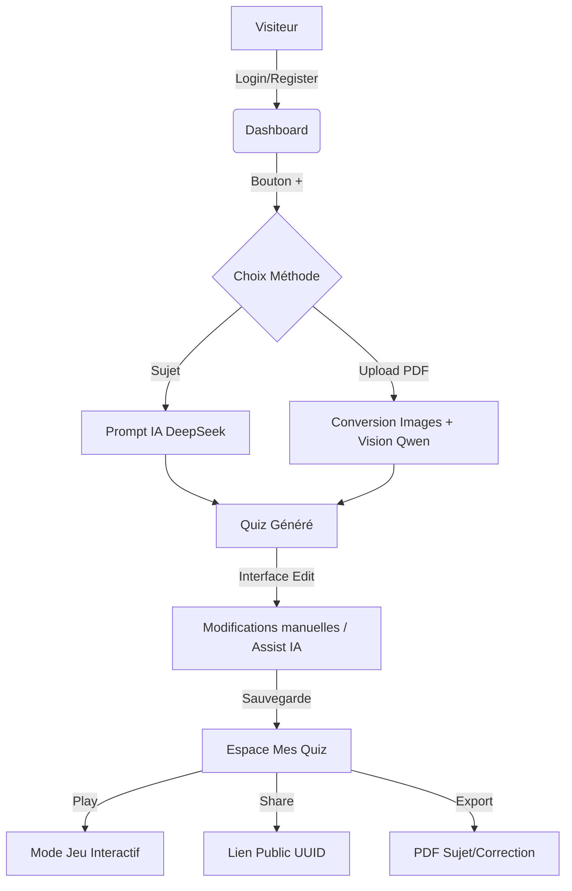

# DOCUMENTATION ULTIME - AI Quiz Maker

## 1. Introduction & Vision
**AI Quiz Maker** est une solution SaaS éducative conçue pour automatiser la création de contenus pédagogiques. En exploitant les capacités des Large Language Models (LLM), l'application supprime la friction entre le cours brut (PDF/Notes) et l'évaluation interactive.

---

## 2. Architecture Globale & Stack
L'application suit une architecture déconnectée (Decoupled Architecture) assurant une séparation nette entre la logique métier et la présentation.

| Couche | Technologie | Justification |
| :--- | :--- | :--- |
| **Client** | Vue 3 + Pinia | Réactivité optimale et état global géré efficacement. |
| **Logic** | Node / Express | I/O non-bloquant, idéal pour les API de streaming de données. |
| **Database** | MySQL + Prisma | Données relationnelles strictes et typage fort via l'ORM. |
| **IA Quiz** | DeepSeek | Coût/Efficacité supérieur pour la génération de JSON structuré. |
| **IA Vision** | Qwen 2.5 VL | Modèle Vision (via OpenRouter) pour l'analyse visuelle des PDF. |
| **PDF** | pdf-to-png-converter | Conversion du PDF en images PNG pour analyse visuelle complète. |

---

## 3. Schéma de Données (Modèle Relationnel)
Le schéma est optimisé pour les performances de lecture lors des sessions de quiz.
- **User** : Gère l'identité et les associations.
- **Quiz** : Point central, lié à un utilisateur (propriétaire).
- **Question** : Liée à un Quiz (Cascade delete activé).
- **Option** : Liée à une Question (Stockage du flag `isCorrect`).
- **Result** : Journalisation des performances (Dashboard User + Invités).

---

## 4. Spécifications de l'API (Documentation Technique)

### Authentification (`/api/auth`)
| Route | Méthode | Payload | Description |
| :--- | :--- | :--- | :--- |
| `/register` | POST | `{email, password, username}` | Crée un utilisateur, hache le MDP et renvoie un JWT. |
| `/login` | POST | `{email, password}` | Vérifie les credentials et renvoie un JWT. |

### Gestion des Quiz (`/api/quiz`)
Toutes les routes ci-dessous requièrent le header `Authorization: Bearer <token>`.

| Route | Méthode | Payload / Params | Rôle |
| :--- | :--- | :--- | :--- |
| `/mine` | GET | - | Liste tous les quiz de l'utilisateur. |
| `/generate` | POST | `{topic, difficulty, nbQuestions}` | Génération IA pure (DeepSeek). |
| `/generate-from-pdf` | POST | `FormData {pdf, topic, ...}` | Conversion PDF en Images + Analyse Vision (Qwen). |
| `/:id` | DELETE | `id` | Suppression sécurisée (vérif ownership). |
| `/:id` | PUT | `{title, questions}` | Édition complète et atomique. |
| `/assist` | POST | `{type, context, ...}` | Outils IA d'aide à la rédaction. |

### Export & Partage
| Route | Méthode | Rôle |
| :--- | :--- | :--- |
| `/:id/pdf` | GET | Téléchargement du sujet PDF (Vierge). |
| `/:id/pdf-correction`| GET | Téléchargement de la correction PDF détaillée. |
| `/public/:uuid` | GET | **Route Publique** : Récupère un quiz par son UUID. |
| `/public/:uuid/submit`| POST | **Route Publique** : Enregistre le score d'un invité. |

---

## 5. Algorithmes & Logique Métier

### Sécurité du Hachage
Le système n'utilise pas un simple `sha256`. Il implémente un hachage HMAC avec `SHA-512` combiné à un `salt` généré aléatoirement (`crypto.randomBytes(16)`).
```javascript
function hashPassword(password, salt) {
    return crypto.createHmac('sha512', salt).update(password).digest('hex');
}
```

### Le Robot IA (`aiService.js`)
L'IA est contrainte par un `SYSTEM_PROMPT` qui impose :
- Format JSON strict (tableau d'objets).
- Aucune ponctuation Markdown superflue.
- Langue française obligatoire.
- **Mélange de Fisher-Yates** : Appliqué côté serveur pour garantir que la bonne réponse n'est pas toujours en position "A" ou "B" (Biais de l'IA).

### Analyse Multimodale (Vision)
Pour le traitement des PDF, l'application n'extrait pas simplement le texte. Elle procède à une analyse visuelle complète :
1. **Rasterization** : Le PDF est converti en images PNG haute résolution via `pdf-to-png-converter`.
2. **Vision Ingestion** : Ces images sont envoyées à **Qwen 2.5 VL** (via OpenRouter).
3. **Compréhension Visuelle** : Le modèle "voit" les schémas, les tableaux, les diagrammes et les formules mathématiques qui seraient perdus avec une simple extraction de texte.

---

## 6. Flux Utilisateur (User Experience)


---

## 7. Défis Techniques & Solutions
1. **Analyse PDF (Vision)** : Les PDF complexes (images, tableaux) sont indéchiffrables via texte brut. Solution : Conversion systématique des pages en images transmises à un modèle Vision (Qwen 2.5 VL) pour une compréhension contextuelle totale.
2. **Mise en page PDF** : `PDFKit` ne gère pas nativement les sauts de page intelligents. Solution : Calcul manuel de `doc.y` et insertion forcée de `doc.addPage()` si l'espace restant est < 100pt.
3. **Persistance Atomique** : Lors de l'édition d'un quiz, les questions sont supprimées et recréées dans une transaction pour éviter les états inconsistants.

---

## 8. Roadmap & Évolutions Futures
- **Mode Multijoueur** : Quiz en temps réel via WebSockets (Socket.io).
- **OCR Manuscrits** : Support de l'analyse des notes prises à la main via photo/scan.
- **Statistiques Avancées** : Graphiques de progression pour les étudiants utilisant l'outil.
- **Portefeuille de compétences** : Association automatique des questions à des compétences cibles.

---
*Documentation générée pour la validation technique du projet AI Quiz Maker.*