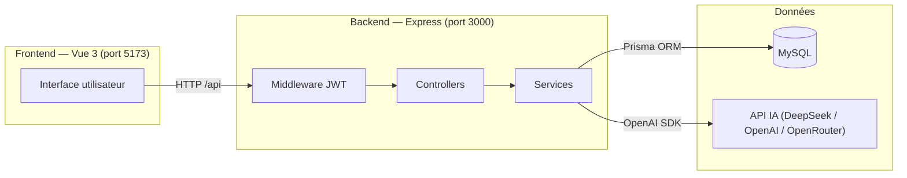
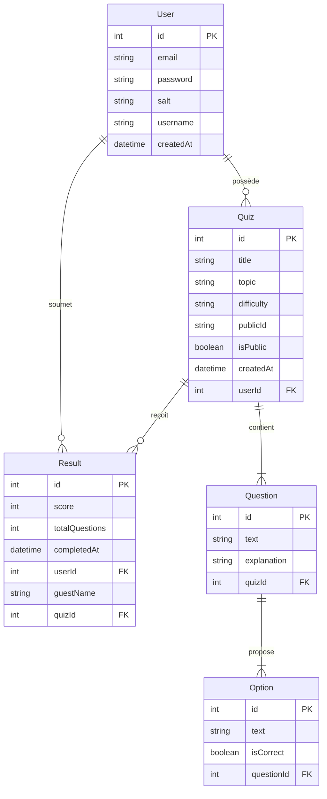
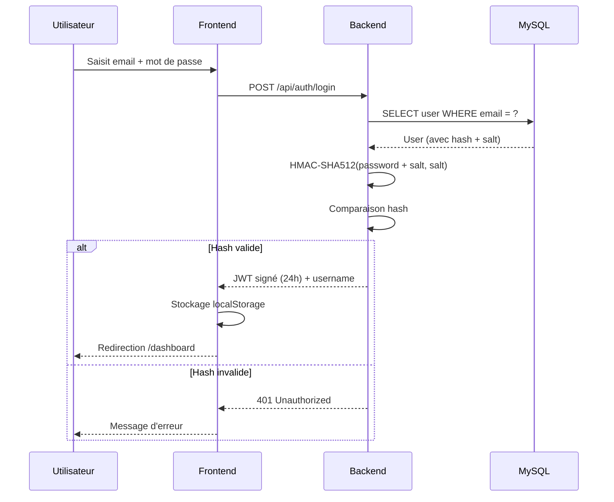
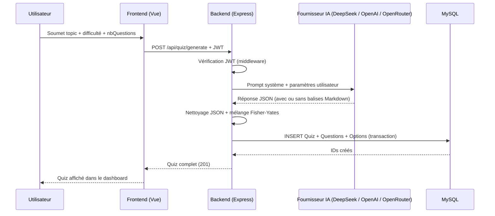

# AIQuizMaker

Application web full-stack de génération de quiz par IA. L'utilisateur saisit un sujet, l'IA génère un QCM complet, exportable en PDF et partageable publiquement via un lien unique.

**Projet BTS SIO SLAM — 2025/2026**

---

## Fonctionnalités

- **Génération automatique de quiz** via l'IA de ton choix (sujet, difficulté, nombre de questions)
- **Édition manuelle** des questions et options, avec assistance IA
- **Jeu interactif** : quiz jouable en ligne avec score immédiat
- **Partage public** via un lien UUID (joueurs anonymes avec pseudo)
- **Export PDF** : feuille de test vierge ou corrigée avec explications
- **Historique des résultats** : scores des utilisateurs connectés et des invités
- **Tableau de bord** : gestion des quiz avec recherche en temps réel

---

## Stack technique

| Couche | Technologie | Version |
|--------|-------------|---------|
| **Frontend** | Vue 3 + Pinia + Vue Router | 3.5 / 3.0 / 4.6 |
| **CSS** | Tailwind CSS | 3.4 |
| **Build** | Vite | 7.1 |
| **Backend** | Node.js + Express | ^20.19 / 5.1 |
| **ORM** | Prisma | 5.19 |
| **BDD** | MySQL | 5.7+ |
| **IA** | Multi-provider (DeepSeek, OpenAI, Groq, Anthropic…) | — |
| **Auth** | JWT (jsonwebtoken) | 9.0 |
| **PDF** | PDFKit | 0.17 |
| **Tests** | Jest (backend) + Vitest (frontend) | 30 / 4.1 |

---

## Prérequis

- **Node.js** v20.19.0 ou ≥ 22.12.0
- **MySQL** 5.7+ (local ou distant)
- **Clé API IA** — au choix parmi les providers listés ci-dessous (OpenRouter et Groq ont un free tier)

---

## Installation

### 1. Cloner et installer les dépendances

```bash
git clone <url-du-repo>
cd AIQuizMaker

# Backend
cd server
npm install

# Frontend
cd ../client
npm install
```

### 2. Configurer les variables d'environnement

```bash
cp server/.env.example server/.env
```

Ouvrir `server/.env` et renseigner au minimum :
- `DATABASE_URL` — URL de connexion MySQL
- `JWT_SECRET` — chaîne aléatoire longue
- `FRONTEND_URL` — `http://localhost:5173`
- Une clé IA (ex: `GROQ_API_KEY` pour le free tier, voir section **Fournisseurs IA**)

### 3. Initialiser la base de données

```bash
cd server
npx prisma migrate dev --name init
```

---

## Démarrage

### Développement (2 terminaux)

```bash
# Terminal 1 — Backend (port 3000)
cd server
npm start

# Terminal 2 — Frontend (port 5173)
cd client
npm run dev
```

L'application est accessible sur **http://localhost:5173**

Le frontend proxifie automatiquement les requêtes `/api` vers `http://localhost:3000` (configuré dans `vite.config.js`).

### Production

```bash
# Build du frontend
cd client
npm run build
# Les fichiers sont générés dans client/dist/

# Le backend ne nécessite pas de build
node server/app.js
```

---

## Fournisseurs IA compatibles

Il suffit de définir la clé correspondante dans `server/.env` — le fournisseur est **détecté automatiquement**, ou sélectionné explicitement via `AI_PROVIDER`.

| Fournisseur | `AI_PROVIDER` | Clé requise | Modèle par défaut | Gratuit ? |
|---|---|---|---|---|
| **DeepSeek** | `deepseek` | `DEEPSEEK_API_KEY` | `deepseek-chat` | Très peu cher |
| **OpenAI** | `openai` | `OPENAI_API_KEY` | `gpt-4o-mini` | Payant |
| **OpenRouter** | `openrouter` | `OPENROUTER_API_KEY` | `meta-llama/llama-3.3-8b-instruct:free` | **Oui (modèles gratuits)** |
| **Groq** | `groq` | `GROQ_API_KEY` | `llama-3.3-70b-versatile` | **Oui (free tier)** |
| **Mistral AI** | `mistral` | `MISTRAL_API_KEY` | `mistral-small-latest` | Peu cher |
| **Together AI** | `together` | `TOGETHER_API_KEY` | `meta-llama/Llama-3-8b-chat-hf` | Crédits offerts |
| **Grok (xAI)** | `grok` | `XAI_API_KEY` | `grok-2-latest` | Payant |
| **Anthropic** | `anthropic` | `ANTHROPIC_API_KEY` | `claude-3-5-haiku-latest` | Payant |
| **Custom** | `custom` | `AI_API_KEY` | via `AI_MODEL` | Selon provider |

> **Custom** permet d'utiliser n'importe quel provider compatible OpenAI (Ollama, LM Studio…) en définissant `AI_BASE_URL`, `AI_API_KEY` et `AI_MODEL` dans le `.env`.

**Ordre d'auto-détection** (si `AI_PROVIDER` non défini) : DeepSeek → OpenAI → OpenRouter → Groq → Mistral → Together → Grok → Anthropic

---

## Variables d'environnement

Toutes les variables sont définies dans `server/.env` (copier depuis `server/.env.example`).

| Variable | Obligatoire | Exemple | Description |
|----------|-------------|---------|-------------|
| `PORT` | Non (défaut 3000) | `3000` | Port du serveur Express |
| `DATABASE_URL` | **Oui** | `mysql://root:@localhost:3306/aiquizmaker` | URL de connexion MySQL (format Prisma) |
| `JWT_SECRET` | **Oui** | `une_phrase_secrete` | Secret pour signer les tokens JWT |
| `FRONTEND_URL` | **Oui** | `http://localhost:5173` | URL du frontend (CORS) |
| `AI_PROVIDER` | Non | `groq` | Provider IA actif. Auto-détecté si absent. |
| `DEEPSEEK_API_KEY` | Conditionnelle | `sk-xxxx` | Clé DeepSeek |
| `OPENAI_API_KEY` | Conditionnelle | `sk-xxxx` | Clé OpenAI |
| `OPENROUTER_API_KEY` | Conditionnelle | `sk-or-xxxx` | Clé OpenRouter |
| `GROQ_API_KEY` | Conditionnelle | `gsk_xxxx` | Clé Groq |
| `MISTRAL_API_KEY` | Conditionnelle | `xxxx` | Clé Mistral AI |
| `TOGETHER_API_KEY` | Conditionnelle | `xxxx` | Clé Together AI |
| `XAI_API_KEY` | Conditionnelle | `xxxx` | Clé xAI (Grok) |
| `ANTHROPIC_API_KEY` | Conditionnelle | `sk-ant-xxxx` | Clé Anthropic (Claude) |
| `OPENROUTER_MODEL` | Non | `mistralai/mistral-7b-instruct` | Surcharge le modèle OpenRouter |
| `AI_API_KEY` | Si custom | `xxxx` | Clé pour provider custom |
| `AI_BASE_URL` | Si custom | `http://localhost:11434/v1` | URL base du provider custom |
| `AI_MODEL` | Si custom | `llama3` | Modèle pour provider custom |

---

## Architecture globale



---

## Architecture du projet

```
AIQuizMaker/
├── README.md
├── client/                          # Frontend Vue 3
│   ├── index.html
│   ├── vite.config.js               # Config Vite + proxy API
│   └── src/
│       ├── main.js
│       ├── App.vue
│       ├── router/index.js          # Routes (5 pages)
│       ├── views/
│       │   ├── HomeView.vue
│       │   ├── LoginView.vue
│       │   ├── RegisterView.vue
│       │   ├── DashboardView.vue    # Tableau de bord (protégé)
│       │   └── PublicQuizView.vue   # Jeu de quiz public
│       ├── components/
│       │   ├── QuizCard.vue
│       │   ├── QuizCreateModal.vue
│       │   ├── QuizEditModal.vue
│       │   ├── QuizDetailModal.vue
│       │   └── QuizGame.vue
│       ├── stores/quizStore.js      # Store Pinia
│       ├── composables/
│       │   ├── useAuth.js
│       │   ├── useApi.js            # authFetch (header JWT)
│       │   └── useQuizGame.js
│       └── utils/difficultyHelpers.js
│
└── server/                          # Backend Node.js / Express
    ├── app.js                       # Point d'entrée Express
    ├── .env.example                 # Template variables d'environnement
    ├── prisma/
    │   ├── schema.prisma            # Schéma BDD (5 modèles)
    │   └── migrations/
    ├── src/
    │   ├── config/
    │   │   ├── constants.js         # Providers IA, limites, JWT
    │   │   └── prisma.js
    │   ├── middleware/authMiddleware.js
    │   ├── routes/
    │   │   ├── authRoutes.js
    │   │   └── quizRoutes.js
    │   ├── controllers/
    │   │   ├── authController.js
    │   │   └── quizController.js
    │   └── services/
    │       ├── aiService.js         # Multi-provider IA + Fisher-Yates
    │       └── pdfService.js        # Génération PDF (PDFKit)
    └── tests/
        ├── setup.js
        ├── aiService.test.js
        ├── authController.test.js
        ├── authMiddleware.test.js
        ├── pdfService.test.js
        ├── quizController.test.js
        └── simple.test.js
```

---

## Routes frontend

| Path | Composant | Auth requise | Description |
|------|-----------|:---:|-------------|
| `/` | HomeView | Non | Page d'accueil |
| `/register` | RegisterView | Non | Inscription (connexion automatique) |
| `/login` | LoginView | Non | Connexion |
| `/dashboard` | DashboardView | **Oui** | Liste des quiz + recherche + création |
| `/play/:uuid` | PublicQuizView | Non | Jeu de quiz public (anonyme) |

La route `/dashboard` redirige automatiquement vers `/login` si l'utilisateur n'est pas authentifié.

---

## API REST

Base URL : `/api`

### Authentification — `/api/auth`

| Méthode | Route | Auth | Corps | Réponse |
|---------|-------|------|-------|---------|
| POST | `/register` | Non | `{email, password, username}` | `{message, token, username}` |
| POST | `/login` | Non | `{email, password}` | `{message, token, username}` |

**Rate limit auth :** 10 requêtes / 15 minutes.

### Quiz — `/api/quiz`

Toutes les routes protégées nécessitent : `Authorization: Bearer <token>`

| Méthode | Route | Auth | Corps / Params | Description |
|---------|-------|------|----------------|-------------|
| POST | `/generate` | Oui | `{topic, difficulty, nbQuestions}` | Génère un quiz via IA |
| GET | `/mine` | Oui | — | Liste les quiz de l'utilisateur connecté |
| PUT | `/:id` | Oui | `{title, questions[]}` | Met à jour le quiz (transaction atomique) |
| DELETE | `/:id` | Oui | — | Supprime le quiz et ses données en cascade |
| POST | `/assist` | Oui | `{type, context, difficulty?, existingQuestions?, globalTopic?}` | Assistance IA pour l'édition |
| GET | `/:id/pdf` | Oui | — | Télécharge le PDF vierge |
| GET | `/:id/pdf-correction` | Oui | — | Télécharge le PDF corrigé avec explications |
| PATCH | `/:id/toggle-public` | Oui | — | Active / désactive le partage public |
| GET | `/:id/results` | Oui | — | Récupère tous les scores d'un quiz |
| GET | `/public/:uuid` | Non | — | Récupère un quiz public (sans les bonnes réponses) |
| POST | `/public/:uuid/submit` | Non | `{score, total, pseudo}` | Enregistre le score d'un invité |

**Rate limit génération IA :** 20 requêtes / heure.

---

## Base de données

Provider : **MySQL** via Prisma ORM.

### Modèles

#### `User`
| Champ | Type | Description |
|-------|------|-------------|
| `id` | Int (PK) | Auto-incrémenté |
| `email` | String (unique) | Adresse email |
| `password` | String | Hash HMAC-SHA512 |
| `salt` | String | Sel aléatoire 16 octets (hex) |
| `username` | String? | Nom d'utilisateur optionnel |
| `createdAt` | DateTime | Date de création |

#### `Quiz`
| Champ | Type | Description |
|-------|------|-------------|
| `id` | Int (PK) | Auto-incrémenté |
| `title` | String | Titre du quiz |
| `topic` | String | Sujet saisi par l'utilisateur |
| `difficulty` | String | `"Facile"` / `"Moyen"` / `"Difficile"` |
| `publicId` | String (unique) | UUID pour le lien de partage public |
| `isPublic` | Boolean | Partage activé ou non |
| `createdAt` | DateTime | Date de création |
| `userId` | Int (FK) | Propriétaire du quiz |

#### `Question`
| Champ | Type | Description |
|-------|------|-------------|
| `id` | Int (PK) | Auto-incrémenté |
| `text` | String (longtext) | Énoncé de la question |
| `explanation` | String? (longtext) | Explication affichée dans le PDF corrigé |
| `quizId` | Int (FK, CASCADE) | Quiz parent |

#### `Option`
| Champ | Type | Description |
|-------|------|-------------|
| `id` | Int (PK) | Auto-incrémenté |
| `text` | String (longtext) | Texte de l'option |
| `isCorrect` | Boolean | Vraie réponse ou non |
| `questionId` | Int (FK, CASCADE) | Question parente |

#### `Result`
| Champ | Type | Description |
|-------|------|-------------|
| `id` | Int (PK) | Auto-incrémenté |
| `score` | Int | Nombre de bonnes réponses |
| `totalQuestions` | Int | Total de questions |
| `completedAt` | DateTime | Date de complétion |
| `userId` | Int? (FK) | `null` si joueur anonyme |
| `guestName` | String? | Pseudo du joueur anonyme |
| `quizId` | Int (FK, CASCADE) | Quiz joué |

> Les suppressions en cascade sont activées sur Question → Option et Quiz → Result.

### Diagramme entité-relation



---

## Sécurité

### Flux d'authentification



### Hachage des mots de passe
Algorithme **HMAC-SHA512** avec sel aléatoire par utilisateur (16 octets en hex, généré via `crypto.randomBytes`).

```
password_hashed = HMAC-SHA512(password + salt, salt)
```

### JWT
- Expiration : **24 heures**
- Stockage côté client : `localStorage`
- Envoyé dans le header : `Authorization: Bearer <token>`

### Rate Limiting (`express-rate-limit`)
- Auth : 10 req / 15 min
- Génération IA : 20 req / 1 heure

### CORS
Configuré pour n'accepter que `FRONTEND_URL` (variable d'environnement).

---

## Intégration IA

### Séquence de génération d'un quiz



### Fournisseur IA

Tous les providers (sauf Anthropic) utilisent le SDK OpenAI avec un `baseURL` différent. Anthropic utilise son SDK natif, abstrait par la fonction `callAI()` dans `aiService.js`. La configuration est validée au démarrage du serveur.

### Mélange Fisher-Yates
Après génération, les options de chaque question sont mélangées pour éviter que la bonne réponse soit toujours en première position (biais de l'IA).

### Extraction JSON robuste
La réponse de l'IA peut contenir du Markdown (` ```json ... ``` `). Le service nettoie automatiquement ces balises avant de parser le JSON.

---

## Export PDF

Bibliothèque : **PDFKit** (génération côté serveur, streaming vers le client).

### PDF vierge (`GET /api/quiz/:id/pdf`)
- En-tête avec titre et difficulté
- Questions numérotées
- Cases à cocher vides pour chaque option

### PDF corrigé (`GET /api/quiz/:id/pdf-correction`)
- Bonne réponse marquée (✓)
- Explication affichée sous chaque question
- Numérotation des pages en pied de page

---

## Tests

### Backend (Jest)

```bash
cd server
npm test
```

| Fichier | Couverture |
|---------|-----------|
| `authController.test.js` | Inscription, connexion, hachage |
| `authMiddleware.test.js` | Vérification JWT |
| `quizController.test.js` | CRUD quiz, routes publiques |
| `aiService.test.js` | Appel IA, extraction JSON |
| `pdfService.test.js` | Génération PDF |
| `simple.test.js` | Tests de base / infrastructure |

### Frontend (Vitest)

```bash
cd client
npm run test
```

Fichiers de test dans `client/src/views/` : `LoginView.test.js`, `RegisterView.test.js`, `PublicQuizView.test.js`

---

## Flux utilisateur

### Utilisateur connecté (propriétaire de quiz)


### Joueur anonyme (quiz public)


